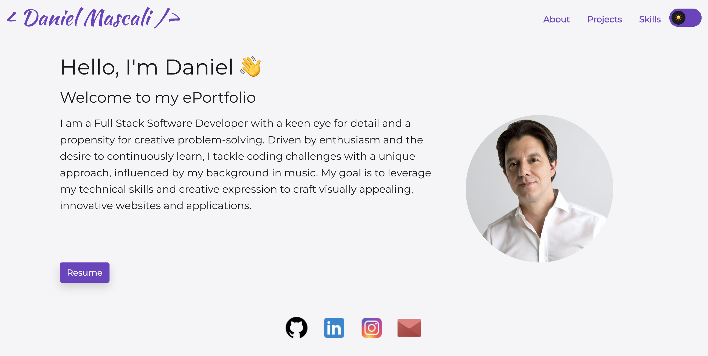

# React Portfolio

## Description
This is a personal portfolio website developed using React.js. The portfolio showcases my latest work, provides an overview about myself, and offers a convenient way for visitors to contact me. The portfolio is fully responsive and optimized for a variety of screen sizes.

  

## Table of Contents
- [Features](#features)
- [Technologies Used](#technologies-used)
- [Installation](#installation)
- [Usage](#usage)
- [License](#license)

## Features

- About Me Section: A personal introduction to visitors giving them insight into my journey, skills, and interests.
- Portfolio Section: Showcases my development projects with images, descriptions, and direct links to the GitHub repositories.
Contact Form: Enables visitors to reach out to me with ease, providing fields for 
- Resume: Offers a direct download link, allowing visitors to get a detailed view of my qualifications and professional journey.
- Toggle Button: An interactive feature allowing users to switch between light and dark mode, enhancing the user experience by allowing visitors to choose the mode that suits their preference.
- Interactive Footer: Features transparent PNG images serving as direct links to my GitHub, LinkedIn, and Instagram profiles, as well as my email address. This allows for a more personalized way to connect with me and follow my professional journey and life updates.

## Technologies Used
- React.js
- Bootstrap
- React-Bootstrap
- CSS

## Installation

The application is deployed on GitHub Pages. You can access it using the following link: [React Portfolio](https://github.com/TurboTeam335/dm-portfolio)

To install the application, follow the steps below:

1. Clone the repository to your local machine
2. Navigate to the cloned repository
3. Run `npm install` to install all necessary dependencies
4. Run `npm start` to start the application

The application will be available on `http://localhost:3000/`.

## Usage

You can access the deployed site using the following link: [Daniel Mascali Portfolio](https://danielmascali.com/)

As you navigate through the 'React Portfolio', you will see different sections:

- 'About Me' section provides a brief introduction about me
- 'Portfolio' section showcases my projects with links to the live application and GitHub repository
- 'Contact' section includes a form where you can fill in your name, email, and message to contact me directly. On successful submission, you will see an alert message confirming your submission.
- There is also a download button which allows you to download my resume for your reference

## License

[MIT](https://choosealicense.com/licenses/mit/)