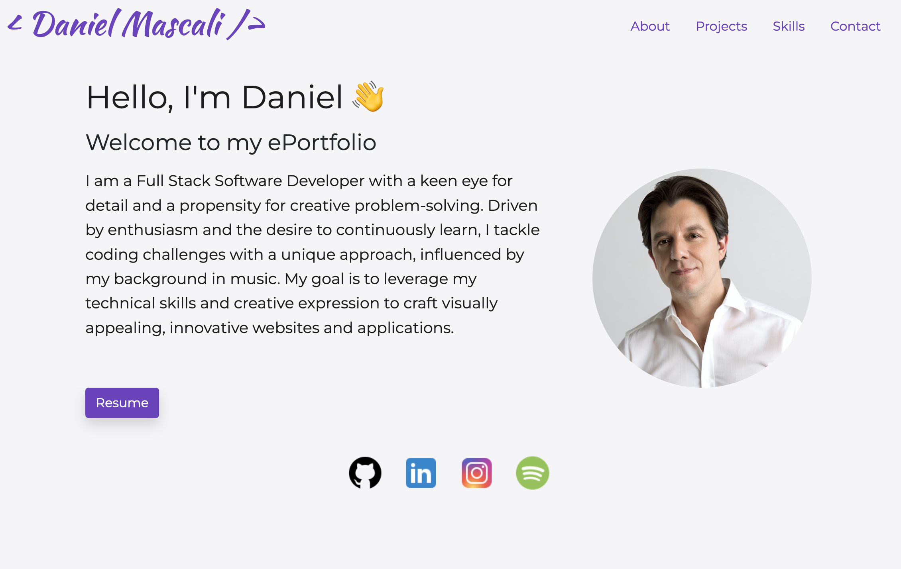

# React Portfolio

## Description
This is a personal portfolio website developed using React.js. The portfolio showcases my latest work, provides an overview about myself, and offers a convenient way for visitors to contact me. The portfolio is fully responsive and optimized for a variety of screen sizes.

  

## Table of Contents
- [Features](#features)
- [Technologies Used](#technologies-used)
- [Installation](#installation)
- [Usage](#usage)
- [License](#license)

## Features

- About Me section introducing myself to visitors
- Portfolio section to showcase my projects and provide links to the deployed applications and GitHub repositories
- Contact form for visitors to easily get in touch with me
- Direct download link for my resume

## Technologies Used
- React.js
- Bootstrap
- React-Bootstrap
- CSS

## Installation

The application is deployed on GitHub Pages. You can access it using the following link: [React Portfolio](https://github.com/TurboTeam335/dm-portfolio)

To install the application, follow the steps below:

1. Clone the repository to your local machine
2. Navigate to the cloned repository
3. Run `npm install` to install all necessary dependencies
4. Run `npm start` to start the application

The application will be available on `http://localhost:3000/`.

## Usage

You can access the deployed site using the following link: [Daniel Mascali Portfolio](https://turboteam335.github.io/dm-portfolio/)

As you navigate through the 'React Portfolio', you will see different sections:

- 'About Me' section provides a brief introduction about me
- 'Portfolio' section showcases my projects with links to the live application and GitHub repository
- 'Contact' section includes a form where you can fill in your name, email, and message to contact me directly. On successful submission, you will see an alert message confirming your submission.
- There is also a download button which allows you to download my resume for your reference

## License

[MIT](https://choosealicense.com/licenses/mit/)